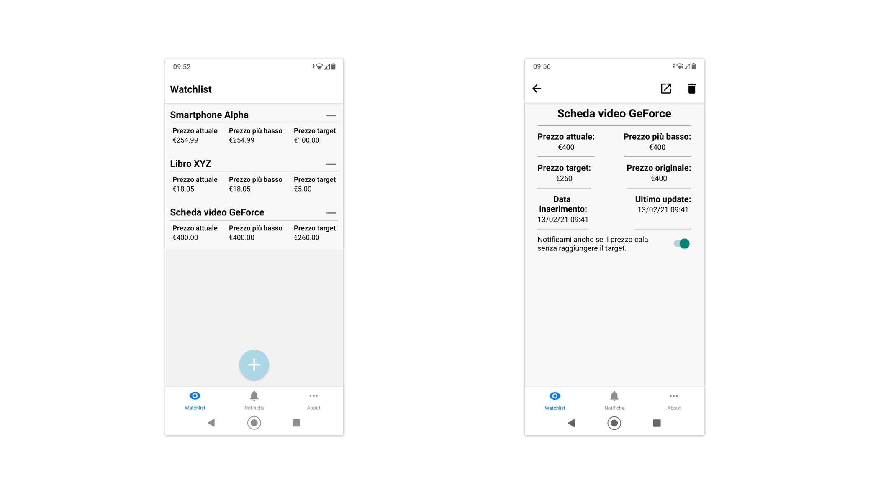

# PriceWatchdog
PriceWatchdog è una app gratuita ed open source per il tracciamento delle variazioni di prezzo di articoli su diversi siti di e-commerce. Compatibile con Android 6.0 e oltre e iOS 10.0 e oltre.

## Download
Questa è la prima versione alpha della app. Potrebbe non essere stabile.

[Download alpha release](https://github.com/fuscoantonio/pricewatchdog/releases/tag/v0.1-alpha)

La versione per iOS non è ancora disponibile per il download.

## Features
* Lista degli articoli di cui si sta tracciando la variazione di prezzo.
* Sistema di notifiche push per l'avviso di abbassamento di prezzo e raggiungimento del prezzo target.
* Schermata con le ultime 50 notifiche ricevute.

## Siti supportati
Siti attualmente supportati da PriceWatchdog:
* Amazon (tutti i domini dovrebbero essere supportati, es. .it, .uk, .com)
* GameStop.it
* Base.com

## Note sul funzionamento
* Al riavvio del dispositivo, **è necessario avviare almeno una volta la app** per consentirle di eseguire operazioni in background (rilevamento prezzo). Non è necessario tenere la app aperta successivamente.
* Per il rilevamento del prezzo, la app esegue delle richieste HTTP in background agli URL forniti. Queste richieste vengono effettuate circa **ogni 15 minuti** e il processo in background dura circa **30 secondi**. A seconda del sito, la app è in grado di rilevare il prezzo di una parte o di tutti gli articoli in lista entro 30 secondi. Dai test, Amazon risulta il sito che richiede più tempo per il recupero del prezzo, permettendo di recuperare intorno agli 8-10 prezzi per richiesta (cioè ogni 15 minuti). Questo considerando una lista di soli articoli Amazon. Se si alternano articoli di Amazon al recupero del prezzo per articoli da altri siti, è possibile rilevare molti più prezzi in 30 secondi.

**NOTA**: le suddette limitazioni di 15 minuti e 30 secondi sono imposte dal sistema operativo.

* Per l'ordine di rilevamento dei prezzi, la app segue il metodo First In First Out, quindi gli articoli inseriti prima saranno quelli che verranno controllati prima. Quando sono stati controllati tutti, la app riparte dal primo inserito.
* PriceWatchdog non fa uso di API dei siti da cui recupera le informazioni.

## Disclaimer
Lo sviluppatore di questa applicazione non ha alcuna affiliazione con i fornitori dei contenuti disponibili.
